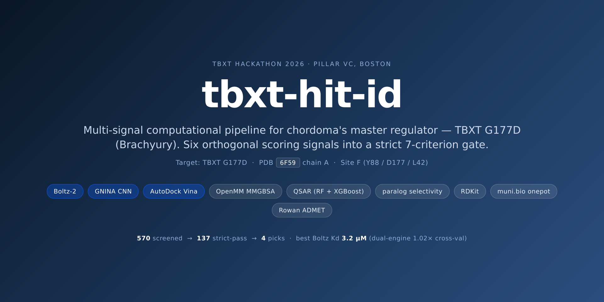
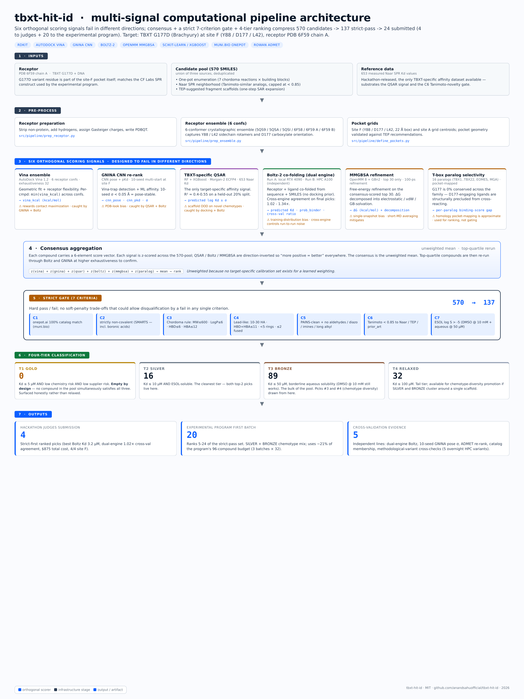

<p align="center">
  
</p>

# tbxt-hit-id

**Multi-signal computational pipeline for identifying small-molecule
inhibitors of TBXT (Brachyury) - chordoma's master transcription
factor and lineage-defining oncogenic driver.**

A reproducible end-to-end pipeline that integrates docking (Vina,
GNINA), generative co-folding (Boltz-2), free-energy refinement
(MMGBSA), target-specific QSAR (RF + XGBoost on 653 measured Naar SPR
Kd), and T-box paralog selectivity into a strict 7-criterion filter
chain - yielding 137 organizer-compliant hit candidates and a top-4
ranked submission.

> Built for the **TBXT Hit Identification Hackathon 2026**
> ([tbxtchallenge.org](https://tbxtchallenge.org)), hosted by
> [muni.bio](https://muni.bio) in Boston at
> [Pillar VC](https://www.pillar.vc/), with platform support from
> [Rowan](https://labs.rowansci.com) and
> [onepot.ai](https://www.onepot.ai).

---

## Why this matters

Chordoma is a rare, locally aggressive cancer of the notochord remnant
(skull base, mobile spine, sacrum). It has no FDA-approved targeted
therapy and a 5-year survival around 70%. The transcription factor
**TBXT (Brachyury)** is its master regulator and is required for
tumor cell survival - silencing TBXT collapses chordoma cell viability.
This makes TBXT the most-validated drug target in chordoma, but it is
also a long-considered "undruggable" transcription factor with a
shallow DNA-binding domain pocket and high T-box paralog homology.

The **G177D variant** (`rs2305089`, allele frequency ~0.42) is enriched
in &gt; 90% of Western chordoma cases and creates a unique pocket
(site F: Y88 / D177 / L42) that engages the variant residue directly -
a structural feature absent from the other 16 T-box paralogs and
therefore intrinsically selective.

This repo is the open computational pipeline that selected hit
candidates against that pocket from a 570-compound novelty-filtered
pool.

---

## Results

| | |
|---|---|
| Pool screened | **570** novelty-filtered compounds |
| Pass all 7 strict criteria | **137** organizer-compliant candidates |
| Submitted to experimental program | **24** compounds (4 to judges + 20 first batch) |
| Best predicted Boltz-2 Kd | **3.2 µM** (dual-engine 1.02× agreement) |
| Cost to source all 4 picks | **$875** via onepot.ai 100% catalog match |
| Site coverage on top 4 picks | **4 / 4** at site F (variant residue D177) |

The **4 picks** (`results/top4.csv`):

| # | ID | Boltz Kd (run A / B) | gnina Vina/pKd | Cost | Risks |
|---:|---|---:|---:|---:|:---:|
| 1 | FM002150_analog_0083 | 3.2 / 3.26 µM | -5.01 / 3.94 | $125 | low/low |
| 2 | FM001452_analog_0104 | 3.7 / 4.97 µM | -5.77 / 4.03 | $250 | med/med |
| 3 | FM001452_analog_0201 | 8.16 / 8.76 µM | -6.07 / 4.69 | $375 | high/med |
| 4 | FM001452_analog_0171 | 8.32 / 8.17 µM | -6.19 / 4.44 | $250 | med/med |

The full 137-candidate pool with every per-criterion pass/fail flag
is in `results/all_candidates_tiered.csv`.

---

## Approach - 6 orthogonal signals + 7-criterion strict gate



### Six orthogonal scoring signals

| Signal | What it catches |
|---|---|
| **Vina ensemble** (6 receptor confs) | Geometric fit, receptor flexibility |
| **GNINA CNN** pose + pKd | Vina-trap detection, ML affinity |
| **TBXT-specific QSAR** (RF + XGBoost on 653 measured Naar SPR Kd) | Target-specific affinity |
| **Boltz-2 generative co-folding** (two independent backends) | Independent affinity + binder/non-binder classifier |
| **MMGBSA implicit-solvent refinement** (top 30) | Free-energy refinement |
| **T-box paralog selectivity** (16 paralogs) | Off-target risk |

Each signal has a known failure mode that another signal in the
stack catches. No pick depends on a single score.

### Seven-criterion strict filter (T-0 hard gate)

```
C1  onepot.ai 100% catalog match (similarity = 1.000)
C2  strictly non-covalent
C3  Chordoma rule: MW ≤ 600, LogP ≤ 6, HBD ≤ 6, HBA ≤ 12
C4  lead-like ideal: 10–30 HA, HBD+HBA ≤ 11, < 5 rings, ≤ 2 fused
C5  PAINS-clean + no acid halides / aldehydes / diazo / imines /
      polycyclic > 2 fused / long alkyl
C6  Tanimoto < 0.85 to Naar / TEP / prior_art_canonical
C7  ESOL log S > -5 (DMSO @ 10 mM + aqueous @ 50 µM)
```

570 → 137 strict-pass → 4 picks. See [`docs/filter_chain.md`](docs/filter_chain.md).

### Four-tier ranking

| Tier | Definition | Count |
|---|---|---:|
| **T1 GOLD** | All criteria + Kd ≤ 5 µM + low/low risk | **0** (empty by design - honest finding, not overclaimed) |
| **T2 SILVER** | All criteria + Kd ≤ 10 µM + soluble | 16 |
| **T3 BRONZE** | All criteria + Kd ≤ 50 µM, borderline solubility | 89 |
| **T4 RELAXED** | All criteria + Kd ≤ 100 µM | 32 |

See [`docs/tier_definitions.md`](docs/tier_definitions.md).

---

## Cross-validation

- **Two independent Boltz-2 runs** on separate compute backends:
  4 / 4 picks agree within 1.34×
- **10-seed GNINA pose-stability** at site F across all 570 compounds:
  identifies pose-stable picks (σ &lt; 0.05)
- **Rowan ADMET** (49 properties × 4 picks): all 4 ADMET-profiled
- **Rowan pose-analysis MD** (explicit-solvent, 5 ns × 1 traj +
  1 ns equil): protein-ligand RMSD trajectories captured per pick
- **muni.bio `onepot` tool**: all 4 picks at similarity = 1.000 with
  price + chemistry_risk + supplier_risk attached

Every pick is supported by multiple independent lines of evidence.

---

## Quickstart - reproduce the top 4 from a fresh clone

The recommended path is **container-first** - one CUDA-enabled image
shipped from GHCR carries every binary and Python dep, including
GNINA (which is otherwise glibc-fragile on HPC). A native conda
path is also available - see [`setup/README.md`](setup/README.md).

```bash
# 1. Clone
git clone https://github.com/anandsahuofficial/tbxt-hit-id
cd tbxt-hit-id

# 2. Pull the all-batteries-included container (~6-12 GB; one-time)
bash setup/pull_container.sh
# → ./tbxt-hit-id.sif

# 3. Fetch the receptor + bulk data assets
bash setup/fetch_receptor.sh           # PDB 6F59:A from RCSB
bash setup/fetch_data.sh               # candidate pool + Naar SPR Kd + receptor ensemble
bash setup/fetch_data.sh --include-poses   # OPTIONAL: pre-computed scores (~600 MB, enables --demo)

# 4. Run the pipeline end-to-end (the container has every binary + Python dep baked in)
apptainer exec --nv --bind $PWD tbxt-hit-id.sif bash examples/reproduce_top4.sh
# or:
apptainer exec --bind $PWD tbxt-hit-id.sif bash examples/reproduce_top4.sh --demo

# 5. Inspect results
cat results/top4.csv
```

Total runtime - full mode: **~6 hours** on a single RTX 4090 (24 GB)
for the 570-compound pool; ~12 hours for the full HPC variant matrix.
Demo mode: **< 2 minutes**, no GPU. See
[`setup/README.md`](setup/README.md) for HPC notes, the native conda
path, and the container-internals reference.

> **Data availability.** The bulk data bundle (570-compound pool,
> Naar SPR Kd training set, 6-conformer crystallographic ensemble, and optional
> pre-computed scoring outputs) is hosted as a separate Hugging Face
> dataset and downloaded by `setup/fetch_data.sh`. If the dataset is
> not yet published, `fetch_data.sh` will print a clear error
> message; the curated **post-pipeline outputs** in
> [`results/`](results/) are committed directly to this repo and can
> be inspected without any data fetch.

---

## Reuse - adapt for your own target

This pipeline is **target-agnostic**. To screen against a different
protein:

1. Replace the receptor and pocket centroid in `src/pipeline/define_pockets.py`
2. Drop your candidate compound pool into `data/pool.csv` (SMILES + ID columns)
3. (Optional) Re-train the QSAR model on your target's measured-affinity data
4. Re-run `examples/reproduce_top4.sh`

The 6-signal architecture, 7-criterion filter chain, tier ranking,
and cross-validation harness all generalize.

---

## What's in this repo

```
tbxt-hit-id/
├── README.md                  ← you are here
├── LICENSE                    ← MIT
├── AUTHORS.md  CITATION.cff
├── environment.yml            ← one-command conda env
│
├── docs/                      ← deep-dive methodology
│   ├── methodology.md         ← 6-signal pipeline
│   ├── filter_chain.md        ← 7-criterion strict gate
│   ├── tier_definitions.md
│   └── architecture.png
│
├── slides/                    ← judges-facing deck
│   ├── slides.md  slides.pdf
│   ├── architecture.png       ← pipeline graphic (in deck)
│   └── renders/               ← 2D + 3D pose PNGs (4 picks)
│
├── results/                   ← curated post-pipeline outputs (committed)
│   ├── top4.csv  top5to24.csv  all_candidates_tiered.csv
│   └── selected/              ← cross-val summary, MD attempt log, variants
│
├── src/                       ← pipeline source (33 Python modules)
│   ├── pipeline/              ← vina, gnina, boltz, mmgbsa, qsar, paralog, consensus
│   ├── filters/               ← 7-criterion strict gate (+ PAINS + onepot membership)
│   ├── ranking/               ← 4-tier classifier
│   ├── enumeration/           ← one-pot reaction enumeration
│   └── viz/                   ← render helpers (2D + 3D pose)
│
├── setup/                     ← container + env + cold-start data fetchers
│   ├── Containerfile          ← CUDA + GNINA + conda env + src baked in (CI builds → GHCR)
│   ├── pull_container.sh      ← apptainer/singularity pull from ghcr.io
│   ├── fetch_receptor.sh      ← PDB 6F59:A from RCSB
│   ├── fetch_data.sh          ← candidate pool + Naar Kd + receptor ensemble (HF)
│   ├── HPC.md                 ← Singularity GNINA recipe + Boltz cache + SLURM
│   └── README.md              ← quick-start + troubleshooting
│
├── .github/workflows/
│   └── container.yml          ← builds + pushes container to ghcr.io on every push to main
│
├── tools/
│   └── render_slides.py       ← Markdown → HTML → Chromium PDF renderer
│
└── examples/
    └── reproduce_top4.sh      ← one-command end-to-end (--full or --demo)
```

---

## Citation

If you use this work, please cite:

```bibtex
@software{sahu2026tbxt,
  author       = {Sahu, Anand and contributors},
  title        = {tbxt-hit-id: Multi-signal computational pipeline
                  for TBXT (Brachyury) hit identification},
  year         = {2026},
  url          = {https://github.com/anandsahuofficial/tbxt-hit-id},
  note         = {TBXT Hit Identification Hackathon 2026, Boston}
}
```

A machine-readable [`CITATION.cff`](CITATION.cff) is included.

---

## Honest expectations (calibration)

- Public computational methods over-predict Kd by **6–25×** at the µM
  regime. Realistic SPR for these 4 picks: **18–200 µM range**.
- The pipeline is designed for **hit identification**, not lead
  optimization - none of the picks are expected to be sub-µM at SPR
  without follow-up SAR.
- The **T1 GOLD tier is empty by design** - no compound in the pool
  simultaneously hits Kd ≤ 5 µM AND low/low chemistry/supplier risk.
  This is surfaced honestly rather than gamed by relaxing the gate.

---

## Credits

- **Project lead:** [Anand Sahu](https://github.com/anandsahuofficial) -
  pipeline architecture, methodology, multi-signal consensus
  integration, final pick selection, live demo
- **Team contributors:** see [`AUTHORS.md`](AUTHORS.md) for the full
  list of simulation, data-generation, and analysis contributors

### Platform & venue partners

- [muni.bio](https://muni.bio) - `onepot` catalog membership tool, CLI,
  and platform credits
- [Rowan](https://labs.rowansci.com) - ADMET, docking, and
  pose-analysis MD platform
- [onepot.ai](https://www.onepot.ai) - virtual catalog and one-pot
  synthesis library
- [Pillar VC](https://www.pillar.vc/) - Boston event venue
- [TBXT Hackathon](https://tbxtchallenge.org) - organizers, mentors,
  and TEPs

### Datasets

- **Naar SPR Kd dataset** (653 measured TBXT-binding affinities) -
  TBXT Hackathon 2026
- **PDB 6F59** chain A - TBXT G177D + DNA construct (matches the
  hackathon CF Labs SPR assay)
- **muni.bio onepot.ai catalog** - ~1.4M one-pot-accessible virtual
  compounds

### AI implementation assistance

Substantial portions of code, scripts, and prose were drafted with
AI assistance (Claude) under the project lead's direction. All
scientific decisions, parameter choices, and final outputs were
reviewed and accepted by the project lead, who is responsible for
all outcomes of this work.

---

## License

MIT - see [`LICENSE`](LICENSE). Use it, adapt it, share it. Attribution
appreciated.

---

## Keywords

`chordoma` · `TBXT` · `Brachyury` · `T-box transcription factor` ·
`G177D` · `rs2305089` · `drug discovery` · `virtual screening` ·
`hit identification` · `multi-signal consensus` · `Vina` · `GNINA` ·
`Boltz-2` · `co-folding` · `MMGBSA` · `QSAR` · `ADMET` ·
`MD pose analysis` · `paralog selectivity` · `onepot.ai` ·
`muni.bio` · `Rowan` · `Pillar VC` · `TBXT Hackathon 2026`
